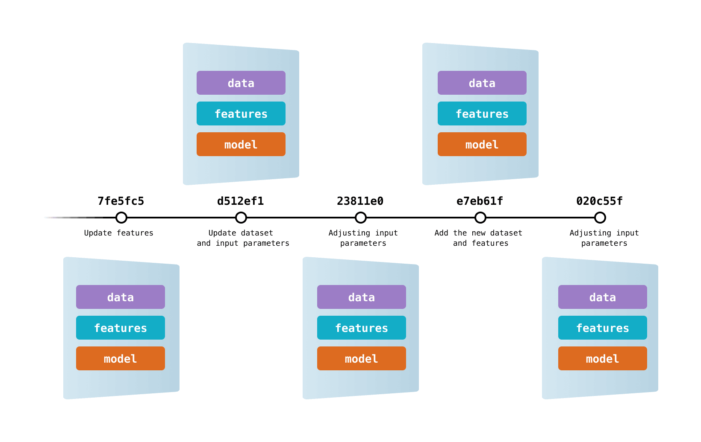

# Week 6: Data and model versioning

## Overview

### Agenda

 * [08:15 – 09:00] – Exercises: DVC
 * [09:15 – 10:00] – Exercises: Continued
 * [10:15 – 11:00] – Lecture: General data versioning strategies
 * [11:15 – 12:00] – Lecture: Continued

### Preparation

For the exercises:

* [DVC: Install](https://dvc.org/doc/install)
* [DVC: Getting started](https://dvc.org/doc/start)
* [DVC: Tutorial](https://dvc.org/doc/use-cases/versioning-data-and-models/tutorial)

For the lecture:

* [DVC](https://dvc.org/doc/)
* [ML Engineering, Chapter 3.11](http://www.mlebook.com/wiki/doku.php) (http://bit.ly/MLEbook-Chapter3)
* [ML-Ops.org: Data Engineering Pipelines](https://ml-ops.org/content/three-levels-of-ml-software)

### Notes

* First exercises, then lectures
* Make sure to install DVC and test that the `dvc` command works for you.
* Slides uploaded to [learnit](https://learnit.itu.dk/course/view.php?id=3023571#section-6).

## Exercises

Data versioning has plenty of similarities but also differences to normal version control that you have just worked with. 

The main thing that we want to accomplish with data version control is to be able to always go back to one version of the data and see how it looked like at a given time -- similar to normal version control. If you want to evaluate your model's performance at time $t_1$, it does not make sense to use data from time $t_2$.

One big difference is that it is simply not possible to meaningfully look at the differences between data versions and review it through a PR. Good PRs tend to only touch a few lines of code at a time, but data can be millions of rows/lines. Not only would it take _you_ ages, but it can also greatly slow down any version control software that has to calculate all the differences. And the data can be enormous, so checking out the whole repo would be impossible on your "small" laptop.

So what's a good strategy to keep track of changes to your data? Briefly explained, you store the data in a remote location and version control _references_ to the data instead.

For that purpuse, we will use the tool _Data Version Control_ (DVC). It can also be used for model versioning and experiment tracking, but we'll touch on that in later lectures. Similar tools include Git Large File Storage (GitLFS) or Pachyderm. Each of these tools have their pros and cons, and DVS might struggle with performance if you have a lot of files, but it serves our purpose of refreshing our git skills and motivate the thinking of storing data remotely well enough.

The goal of the following exercises is to take you through the journey of linking data to your project 

### Exercise 0: Installation

Make sure DVC is installed:
`dvc --version`
Does this command run and show a version number above 3.something? Great!

### Exercise 1: Initialise DVC in repository

Next we want to start using DVC with one of our projects. Let's follow DVC's documentation on [https://dvc.org/doc/start](getting started):

1. Run `dvc init` 
   
 
Getting an <i>ERROR: failed to initiate DVC - path is not tracked by any supported SCM tool (e.g. Git)</i> error? 
 

   Make sure you have initialised git in your directory. Run the following to start a git repo <pre>git init</pre>

   If this does not work, try and run it with the --subdir argument if you are initialising this in a subdirectory of your project. <pre> dvc init --subdir</pre>

2. Check which files DVC added to the repo (_what is each file used for?_)
   
 
Hint 

   <tt> git status </tt>
   
   1. .dvc/.gitignore (dvc-specific things for git to ingore, like local config.local)
   2. .dvc/config (project-level dvc config, keeps tracks of various settings like remotes, local path to auth, etc)
   3. .dvcignore (file types for dvc to ignore if e.g. adding directories)
  

3. Git commit new files
   
 
Hint 
 
   <tt> git commit -m "YOUR COMMIT MSG"</tt>
  

### Exercise 2: Start tracking files

It's time to add files that we want to track with DVC. We don't want to include the files in our repo but instead track and use references to the data stored elsewhere.

There's multiple [storage solutions in DVC](https://dvc.org/doc/user-guide/data-management/remote-storage). Generally they require some kind of authentication so that you can read and write from the location but that is beyond the scope for now. Instead we will just use a "local" remote -- that is, just a different directory on your laptop than this project and pretend it's a "remote" remote.

1. Fetch data locally
   
 
Suggestion using command line
 
    <pre> mkdir -p data/raw
    wget https://github.com/Jeppe-T-K/itu_sdse_2024/raw/w06-exercises/w06/resources/data/raw/coco.jpeg -P data/raw/
    </pre>
    

2. Add file to tracking with DVC
   
 
Hint: It's essentially the same as git
 
    <pre> dvc add data
    </pre>
    

3. Ensure metadata files are tracked by git (_which files are added?_)
   
 
Hint: add and commit newly created files
 
    <pre> git add data.dvc .gitignore
    git commit -m "Added data/ to dvc"
    </pre>
    

4. What info does each .dvc file contain?
   
 
Hint
 
    <pre> 
       less *.dvc # use :n, :p, q, to go to next file, previous file and quit
    </pre>
    

### Exercise 3: Using a remote

Remotes work in a similar way as with git: it's some place else that keeps track of you data. DVC stores the data in an efficient binary format and allows you to fetch the data again easily and quickly when needed for e.g. ML stuff.

> **Note**: we will simply download the data locally and work with it there, but if you have a remote set up already with data, you can follow [this method](https://dvc.org/doc/user-guide/data-management/importing-external-data#how-importing-external-data-works) for using "external data" (not necessary for now).

1. Configure remote ("local") with `dvc remote add -d <remote_name> /localpath/to/remote`
   
 
Want to use actual remote?
 
    You're welcome to try and set it up. Take your pick from <a href="https://dvc.org/doc/user-guide/data-management/remote-storage"> all these options </a>
    

2. Add and commit changes to .dvc/config
   
 
Hint: you know the flow now with git
 
    <pre> git add .dvc/config
    git commit -m "Added remote to dvc" </pre>
    

3. Push DVC data to remote
   
 
Hint: It's essentially the same as git
 
    <pre> dvc push </pre>
    

4. You accidentally (or intentionally) deleted your local data in /data/raw. How would you fetch it again?
   
 
Hint: It's essentially the same as git
 
    <pre> dvc pull </pre>
    

### Exercise 4: Switching between data versions

Quite often you don't use the raw data directly in your models but run it through a data pipeline to create a cleansed or ML-ready dataset. That also means that the files/artifacts you create and want to keep track of can change with every run of your code.

For this exercise, we will essentially follow the steps in Exercise 1, but in addition we will switch to another branch in git and make changes to our cleansed data. The challenge is then to recover the original data on the main branch!

1. Create a "cleansed" version of your data
   
 
Suggestion using same image
 
    <pre>mkdir -p data/cleansed
    wget https://github.com/Jeppe-T-K/itu_sdse_2024/raw/w06-exercises/w06/resources/data/cleansed/coco_cropped.png -P data/cleansed
    </pre>
    

2. Add new data to dvc + git
   
 
Hint: repeat steps 2-3 from Exercise 1
 
    <pre> 
    dvc add data/
    git add data.dvc
    git commit -m "Added cleansed data"
    (git push)
    dvc push
    </pre>
    

3. Create new branch in git
   
 
Hint
 
    <pre> git checkout -b "my_branch_name"
    </pre>
    

4. Modify your cleansed data (_save to same file name!_)
   
 
Suggestion using pre-made image
 
    <pre>
    rm data/cleansed/coco_cropped.png
    wget https://github.com/Jeppe-T-K/itu_sdse_2024/raw/w06-exercises/w06/resources/data/cleansed/coco_cropped_text.png -P data/cleansed
    mv data/cleansed/coco_cropped_text.png data/cleansed/coco_cropped.png
    </pre>
    

5. Add changed file to dvc + git
   
 
Hint: repeat steps from step 2
 
    <pre> 
    dvc add data/
    git add data.dvc
    git commit -m "Added cleansed data from new method"
    (git push)
    dvc push
    </pre>
    

6. To back to the main branch and check out your cleansed data (_is it the same that you originally added to dvc?_)
   
 
Hint
 
    No, it's not. Not unless you made a mistake, anyway.

    To go back to the main branch, you can run `git checkout main`

    <pre> 
    dvc pull
    </pre>
    

And that's it! Now you've done the whole flow of tracking raw data, creating + modifying a cleansed dataset, and switching between different data versions.

Much of the same thinking about version control of big files also applies to models. However, the flow for creating, testing, evaluating and deploying models through _experiments_ usually require a bit more infrastructure, so before going crazy with exercises for that, we'll instead focus next time on creating a project that follows a nice, clean structure to make our lives easier.
