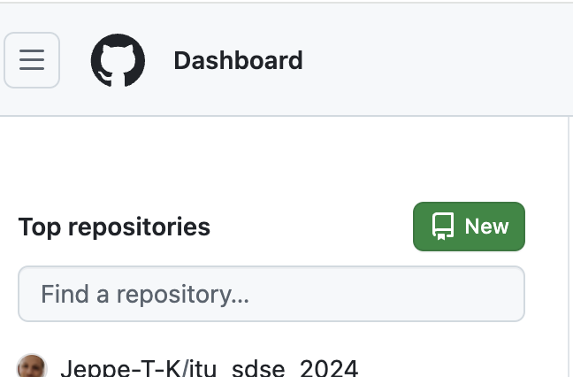

# Week 7: Data and model versioning

## Overview

### Agenda

 * [08:15 – 09:00] – Follow-along exercises: Cookiecutter Data Science
 * [09:15 – 10:00] – Follow-along exercises: Continued
 * [10:15 – 11:00] – Lecture: MLOps in organisations
 * [11:15 – 12:00] – Lecture: MLOps stages

### Preparation

For the exercises:

* [Cookiecutter Data Science: Install](https://cookiecutter-data-science.drivendata.org/)
* [Cookiecutter Data Science: Opinions on structure](https://cookiecutter-data-science.drivendata.org/opinions/)
* [Cookiecutter Data Science: Using the template](https://cookiecutter-data-science.drivendata.org/using-the-template/)
* [Cookiecutter Data Science: Github repo](https://github.com/drivendataorg/cookiecutter-data-science)

For the lecture:

* [ML-Ops.org: Three levels of ML Software](https://ml-ops.org/content/three-levels-of-ml-software)
* [ML-Ops.org: End-to-End ML](https://ml-ops.org/content/end-to-end-ml-workflow)
* [Google & MLOps levels](https://cloud.google.com/architecture/mlops-continuous-delivery-and-automation-pipelines-in-machine-learning)


### Notes

* The exercises will be a follow-along coding session, mainly using terminal/CLI
* Make sure to install Cookiecutter Data Science and test that the `ccds` command works for you.
* Slides uploaded to [learnit](https://learnit.itu.dk/course/view.php?id=3023571#section-7).

## Exercises

> [!NOTE]
> **Learning goals**
> <i>By the end of the exercises, we expect you to be able to do the following:</i>
> <ul>
> <li>Start a data science project with version control that follows the CCDS format</li>
> <li>Explain the motivation for the structure of a data science project</li>
> <li>Share your repo with others and work on the same code</li>

Whenever you start a coding project, there's always the question of how you will structure the code.

Where is the main entry point into the code? What util functions do you need to add? Which components does your project require?

There is obviously not _one_ correct way of doing it, and it very much depends on what kind of project you're building. A good starting point for that is [_Cookiecutter_](https://cookiecutter.readthedocs.io/en/stable/README.html), which is a tool that can help you set up various projects using whichever [template](https://www.cookiecutter.io/templates) that suits your purpose.


For these exercises, we will use a specific template for Data Science, called [Cookiecutter Data Science](https://cookiecutter-data-science.drivendata.org/). This is not by any means the only way to structure a data science project, and we will in the subsequent lessons work on adding extra pieces to our project, but the template has [well-reasoned arguments](https://cookiecutter-data-science.drivendata.org/opinions/) as to why. But first let's get our hands dirty.


### Exercise 0: Installation

Make sure Cookiecutter Datascience is installed:
`pipx install cookiecutter-data-science`

Try running it with:
`ccds --version`

Does this command run and show a version number above 2.something? Great!

### Exercise 1: Start your DS project

Next we want to start using Cookiecutter with one of our projects. Let's be inspired by CCDS's documentation on [their homepage](https://cookiecutter-data-science.drivendata.org/using-the-template/):


1. <details> <summary> Initialise CCDS in directory </summary>
   In the terminal, run <code>ccds</code>

   <pre><i><u>Discuss in pairs what each option does</u></i></pre>
   </details>
   
2. <details> <summary> Initialise git in the repo</summary> 
   In the terminal, run <code>git init</code>
   </details>

3. <details> <summary>Inspect the structure of the resulting repo </summary>

   ```

   ├── LICENSE            <- Open-source license if one is chosen
   ├── Makefile           <- Makefile with convenience commands like `make data` or `make train`
   ├── README.md          <- The top-level README for developers using this project.
   ├── data
   │   ├── external       <- Data from third party sources.
   │   ├── interim        <- Intermediate data that has been transformed.
   │   ├── processed      <- The final, canonical data sets for modeling.
   │   └── raw            <- The original, immutable data dump.
   │
   ├── docs               <- A default mkdocs project; see www.mkdocs.org for details
   │
   ├── models             <- Trained and serialized models, model predictions, or model summaries
   │
   ├── notebooks          <- Jupyter notebooks. Naming convention is a number (for ordering),
   │                         the creator's initials, and a short `-` delimited description, e.g.
   │                         `1.0-jqp-initial-data-exploration`.
   │
   ├── pyproject.toml     <- Project configuration file with package metadata for 
   │                         {{ cookiecutter.module_name }} and configuration for tools like black
   │
   ├── references         <- Data dictionaries, manuals, and all other explanatory materials.
   │
   ├── reports            <- Generated analysis as HTML, PDF, LaTeX, etc.
   │   └── figures        <- Generated graphics and figures to be used in reporting
   │
   ├── requirements.txt   <- The requirements file for reproducing the analysis environment, e.g.
   │                         generated with `pip freeze > requirements.txt`
   │
   ├── setup.cfg          <- Configuration file for flake8
   │
   └── {{ cookiecutter.module_name }}   <- Source code for use in this project.
      │
      ├── __init__.py             <- Makes {{ cookiecutter.module_name }} a Python module
      │
      ├── config.py               <- Store useful variables and configuration
      │
      ├── dataset.py              <- Scripts to download or generate data
      │
      ├── features.py             <- Code to create features for modeling
      │
      ├── modeling                
      │   ├── __init__.py 
      │   ├── predict.py          <- Code to run model inference with trained models          
      │   └── train.py            <- Code to train models
      │
      └── plots.py                <- Code to create visualizations   
   ```

   <pre><i><u>Discuss in pairs how this structure makes sense to you</u>

   <li>Do you understand where the ML code goes?</li>
   <li>What does each of the pre-generated files do?</li>
   <li>Any terms that you don't know what they mean?</li>
   <li>Other confusing things?</li></i></pre>

   </details>

4. <details><summary>Start tracking new files with git</summary>
   <tt> git add .</tt>

   <tt> git commit -m "Initial DDCS commit"</tt>

   <pre><i><u>What does <code>git add .</code> do?
   Also: what's in .gitignore?</u></i></pre>

  </details>

### Exercise 2: Interlude

Let's take a step back and reflect on what we have done so far, and more importantly, _why_ and _how_ it ties into what you've learned so far.

<figure>
  
  <figcaption><i>Google's ML Maturity level 0, from <a href="https://cloud.google.com/architecture/mlops-continuous-delivery-and-automation-pipelines-in-machine-learning">https://cloud.google.com/architecture/mlops-continuous-delivery-and-automation-pipelines-in-machine-learning</a></i></figcaption>
</figure>

ML project quite often follow a very manual process. For example, you might have a Python notebook that does some processing of your data and outputs it _somewhere_. You then run another notebook or script that takes this data, does _some_ training (maybe also the evaluation all at once) before sharing the results _somehow_.

This is not sustainable for a productionised ML project multiple reasons.

1. People will have _no_ idea how to re-use/contribute to any of your code.
2. If you go on vacation and nobody is there to re-run the model, tough luck to the company (_and no, while it seems tempting to make yourself indispensible to the company this way, it's not worth it_).
3. Notebooks are terrible for any production code!
   1. You _always_ end up with code with a non-linear flow where you have to run cell 1&rarr;3&rarr;2&rarr;5&rarr;12&rarr;etc before it runs "correctly".
   2. Version control of notebooks is... weird.
   3. They tend to do everything at once.
   4. [Kaggle competitions](https://www.kaggle.com/code) != production-ready code 

There are more bad coding patterns than it's possible to list, so let's instead turn to some guiding principles that you can follow. Based on [this list of opinions from CCDS](https://cookiecutter-data-science.drivendata.org/opinions), these relate to:

* Data versioning strategy (essentially Week 6's lecture)
* Notebooks for exploration, source code for repetition
* Keep your modeling organized
* Build from the environment up
* Keep secrets and configuration out of version control
* Adapt to your use-case

Each of these are explained in more detail in the link, so you are encouraged to read it through yourself.

### Exercise 3: Collaboration

You have your project set up locally, and you are tracking the relevant files through git. But what you really want is to make sure you set up a remote, say, in Github, so you can start collaborating on the same codebase.

Since you will be using github.com in this course, now is a good time to get started. If you don't want to use your normal github.com user (if you have one, not the ITU one) for this course, feel free to create a dummy one.

For this exercise, we want to simulate a a workflow where you (and a partner, if possible) contribute with code to a public repository. In this exercise you will therefore try out 1) setting up a new github repo, 2) push and pull new code to the repo, and 3) clone your partner's code.

1. <details> <summary> Create new repo on github.com </summary>
   <figure>
   
   <figcaption><i>Create a new repo on Github using the green button shown to the right.</i></figcaption>
   </figure>
   </details>
2. <details> <summary> Push your code to this new remote (<i>hint: <a href="https://lasselundstenjensen.github.io/itu-bds-sdse/lessons/git-basics/remote-and-fetch">these lessons covered it</a></i>)</summary>
   <tt>git remote add origin git@github.com:&lt;username&gt;/&lt;new_repo&gt;.git</tt>

   <tt>git push</tt>

   <pre><i><u>We are actually missing an argument to git push. Can you find out what?</u></i></pre>
   <details><summary>Hint:</summary>
   <tt>git push --set-upstream origin main</tt>
   </details>
   </details>
3. <details> <summary> Try to work on a partner's repo </summary>
   Go to a new unversioned/ungitted directory (<i>~/Projects for me</i>) and clone a partner's repo:

   <tt>git clone git@github.com:&lt;username&gt;/&lt;new_repo&gt;.git</tt>

   Now you have a local copy of the code that you can work with!
   </details>
4. <details> <summary> Try and push changes to your partner's repo </summary>
   Good developer practice is to not work directly on main since that is reserved for production code. Instead create a new branch:

   <tt>git checkout -b w07-model-training-script</tt>

   Next step is to make some meaningful changes. As hinted with the branch name, maybe you want to create the training script for the model.

   For now let's not be concerned with how train.py should look like. It depends on the project and such, but it generally takes data and model configurations as input and outputs a trained model. For now, let's just <tt>touch &lt;project_name&gt;/modeling/train.py</tt>.

   And then follow the typical git flow:

   <tt>git add &lt;project_name&gt;/modeling/train.py</tt>
   
   <tt>git commit -m "feat: model training script added"</tt>
   
   <tt>git push</tt>

   <pre><i><u>How does this git push differ from when you pushed to your own repo?</u></i></pre>

   </details>

This was a very preliminary example of working together on code. There are more aspects to it, such as branching strategies, code reviews and pull requests, but that will be covered in later lectures. For now, pat yourselves on the back for actually starting a data science project with a more clear strategy than 80% of companies!
